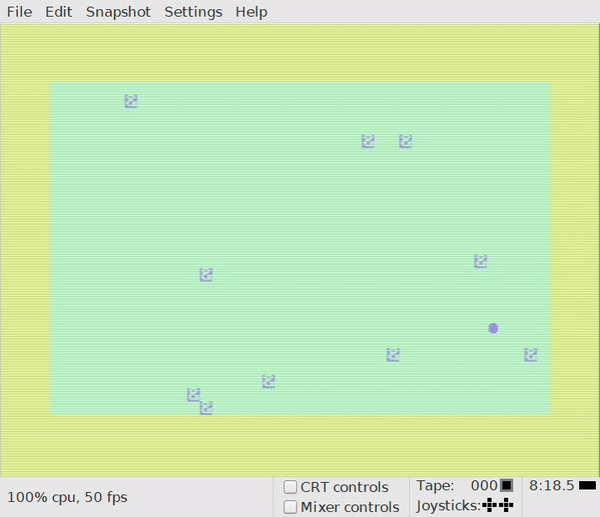
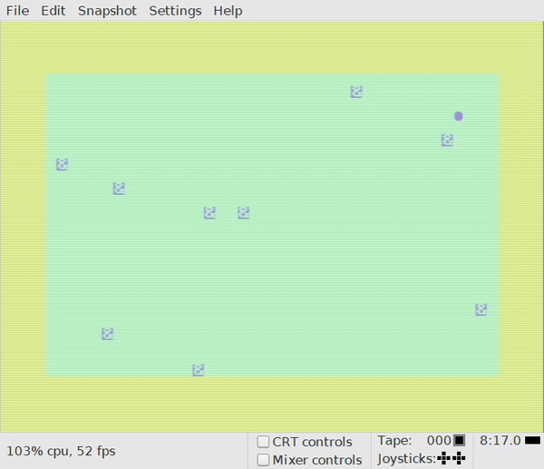
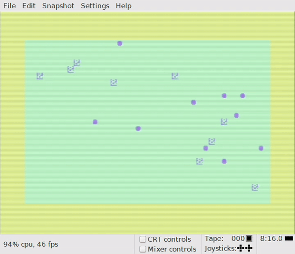

Recreating the Commodore 64 User Guide code samples in cc65. Part two: Bouncing balls
===============================================================================
Now, children, turn to page 65 of the Commodore 64 User Guide, chapter 5 «Advanced Color Graphic Commands». In this
chapter you are taught how to use the POKE command to put characters directly to the screen. There’s a really nifty
example named «more bouncing balls» in this chapter. The full example will display a moving ball that bounces off the
screen walls as well as bouncing off randomly positioned characters:

```basic
10 print chr$(147)
20 poke 53280,7: poke 53281,13
21 for l = 1 to 10
25 poke 1024 + int(rnd(1)*1000), 166
27 next l
30 x = 1 : y = 1
40 dx = 1 : dy = 1
50 poke 1024 + x + 40 * y, 81
60 for t = 0 to 10 : next
70 poke 1024 + x + 40 * y, 32
80 x = x + dx
85 if peek(1024 + x + 40 * y) = 166 then dx = -dx: goto 80
90 if x <= 0 or x >= 39 then dx = -dx
100 y = y + dy
105 if peek(1024 + x + 40 * y) = 166 then dy = -dy: goto 80
110 if y <= 0 or y >= 24 then dy = -dy
120 goto 50
```

As before, you may run this example in VICE. Just paste the code into VICE and type RUN. The result may look something
like this:


But, hey! Where’s the ball? It sort of comes and goes! What gives!? The reason is a mixture of an inadequate animation
coding and that the software used for recording the VICE screen captures the screen grabs at the «wrong» time. The
result looks better when running in the emulator, but even then the ball seems to blink all the time. The culprit can be
found in these lines:

```basic
50 poke 1024 + x + 40 * y, 81
60 for t = 0 to 10 : next
70 poke 1024 + x + 40 * y, 32
```

Line 50 draws the ball to the screen, while line 60 runs a small loop that allows some time to pass before the ball is
cleared from the screen, which happens at line 70. Although this creates the illusion of the ball moving around the
screen, it also looks like the ball is blinking.

For the C version of this program, I’d like to fix the animation routine so that the ball doesn’t seem to be blinking.
Also, since the C version will run much faster than the BASIC version, I need to add some code to slow down the
animation so that it will be possible to see the ball on the screen. This can be implemented in different ways, but the
solution I’ve chosen here is to wait for the position of the raster line to reach the bottom of the screen. Doing so
will ensure that the animation will run smoothly in 50 frames per second on a PAL version of the Commodore 64, or 60 FPS
on an NTSC version. (The VICE emulator seems to be running «C64C PAL» as the default version).

This is the C code I came up:

```c
// bouncing-balls.c
#include <stdio.h>
#include <stdlib.h>
#include <peekpoke.h>
#include <time.h>

int v = 0xD000;	// START OF DISPLAY CHIP
int x = 1, y = 1;
int dx = 1, dy = 1;

// Need wait function to slow down loop
void rasterWait(void) {
	unsigned char raster;
	do {
		raster = PEEK(v + 18);
	} while (raster < 250 || raster > 252);
}

// Add to x coordinate and check if inside screen boundaries
void addX() {
	x += dx;
	if (x < 0 || x > 39) {
		dx = -dx;
		addX();
	}		
}

// Add to y coordinate and check if inside screen boundaries
void addY() {
	y += dy;
	if (y < 0 || y > 24) {
		dy = -dy;
		addY();
	}
}

// Check if ball has collided with collision object
void checkBackgroundCollision() {
	if (PEEK(1024 + x + 40 * y) == 166) {
		// If collision, bounce back in either x or y direction
		if (rand() % 2 == 0) {				
			dx = -dx;
			addX();
		} else {
			dy = -dy;
			addY();				
		}
	}		
}	

int main (void) {
	int l, oldPos;
	srand(time(NULL));
	printf ("%c", 147);
	POKE(v + 24,21); // Set upper case
	POKE(v + 32, 7); // Set border color
	POKE(v + 33, 13); // Set background color
	// Put collision objects in random locations
	for (l = 0 ; l < 10 ; l++) {
		POKE(1024 + rand() % 1000, 166); 
	}
	do {
		rasterWait();
		oldPos = 1024 + x + 40 * y;
		addX();
		addY();
		checkBackgroundCollision();
		POKE(1024 + x + 40 * y, 81);
		POKE(oldPos, 32); // Clear last position
	} while (1);
	
    return EXIT_SUCCESS;	
}
```

After compiling and building this code and running it in VICE, the following should be seen on the screen:



The animation is now as smooth as an android’s bottom and with no blinking ball. In order to prevent the ball from
blinking, we store the last ball position before adding to the x/y coordinates of the ball:

```c
oldPos = 1024 + x + 40 * y;
addX();
addY();
```

Then we insert a «space» character on the previous position after drawing the ball’s new position:

```c
POKE(1024 + x + 40 * y, 81);
POKE(oldPos, 32); // Clear last position
``` 

As mentioned earlier, in order to get smooth animations we need to check the raster counter and wait until it reaches a
certain position before continuing the animation loop:

```c
unsigned char raster;
do {
   raster = PEEK(v + 18);
} while (raster < 250 || raster > 252);
```

The raster counter is located in VIC register #18.

But why is this example called «bouncing balls» when there’s only one ball on the screen? Boooring! Let’s expand the
example and see if we can draw multiple moving balls on the screen! This is a simple task of changing the code to use
arrays for x/y positions and x/y directions, changing some functions to accept a ball number parameter and adding a
function for initializing the ball parameters so that the different balls starts at different random locations on the
screen. The resulting code looks like this:

```c
// bouncing-balls-expanded.c
#include <stdio.h>
#include <stdlib.h>
#include <peekpoke.h>
#include <time.h>

#define BALL_COUNT 10

int v = 0xD000;	// START OF DISPLAY CHIP
int x[BALL_COUNT], y[BALL_COUNT];
int dx[BALL_COUNT], dy[BALL_COUNT];

// Need wait function to slow down loop
void rasterWait(void) {
	unsigned char raster;
	do {
		raster = PEEK(v + 18);
	} while (raster < 250 || raster > 252);
}

// Add to x coordinate and check if inside screen boundaries
void addX(ballNo) {
	x[ballNo] += dx[ballNo];
	if (x[ballNo] < 0 || x[ballNo] > 39) {
		dx[ballNo] = -dx[ballNo];
		addX(ballNo);
	}		
}

// Add to y coordinate and check if inside screen boundaries
void addY(ballNo) {
	y[ballNo] += dy[ballNo];
	if (y[ballNo] < 0 || y[ballNo] > 24) {
		dy[ballNo] = -dy[ballNo];
		addY(ballNo);
	}
}

// Check if ball has collided with background
void checkBackgroundCollision(ballNo) {
	if (PEEK(1024 + x[ballNo] + 40 * y[ballNo]) != 32) {
		// If collision, bounce back in either x or y direction
		if (rand() % 2 == 0) {				
			dx[ballNo] = -dx[ballNo];
			addX(ballNo);
		} else {
			dy[ballNo] = -dy[ballNo];
			addY(ballNo);				
		}	
	}		
}	

// Initialize ball data 
void initBalls() {
	int ballNo;
	for (ballNo = 0 ; ballNo < BALL_COUNT ; ballNo++) {			
		x[ballNo] = rand() % 40;
		if (x[ballNo] < 20) {
			dx[ballNo] = 1;
		} else {
			dx[ballNo] = -1;
		}
		y[ballNo] = rand() % 24;
		if (y[ballNo] < 12) {
			dy[ballNo] = 1;
		} else {
			dy[ballNo] = -1;
		}
	}
}

int main (void) {
	int l, oldPos, ballNo;
	srand(time(NULL));
	initBalls();
	printf ("%c", 147);
	POKE(v + 24,21); // Set upper case
	POKE(v + 32, 7); // Set border color
	POKE(v + 33, 13); // Set background color
	// Put collision objects in random locations
	for (l = 0 ; l < 10 ; l++) {
		POKE(1024 + rand() % 1000, 166); 
	}
	do {
		rasterWait();
		for (ballNo = 0 ; ballNo < BALL_COUNT ; ballNo++) {
			oldPos = 1024 + x[ballNo] + 40 * y[ballNo];
			addX(ballNo);
			addY(ballNo);
			checkBackgroundCollision(ballNo);
			POKE(1024 + x[ballNo] + 40 * y[ballNo], 81);		
			POKE(oldPos, 32); // Clear last position
		}
	} while (1);
	
    return EXIT_SUCCESS;	
}
```

Running this program will produce the following output:



10 glorious balls on the screen at the same time! Splendid! If you’d like to see even more balls, change the ball count
at the following line:

```c
#define BALL_COUNT 10
```

That’s it! Have fun experimenting with the code, just like I did with the original BASIC code back in the days. The next
chapter will deal with [sprites](sprites.md). Oh, yeah!