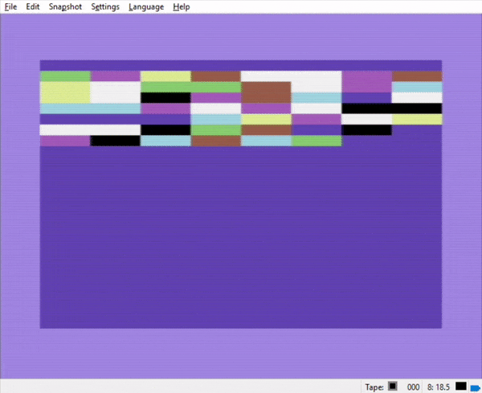
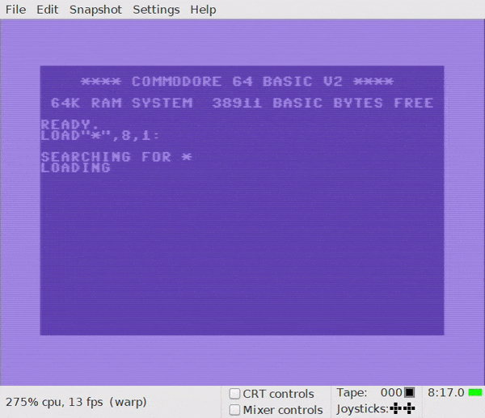

Recreating the Commodore 64 User Guide code samples in cc65. Part one: Automatic color bars
================================================================
So there was a «The c64 Mini» lying under your Christmas tree this year. You’ve played through the built-in games, and
now you are asking yourself: «How do I make my own c64 games?» Well, you’ve come to the right place!

Just like the original Commodore 64 computer, The c64 Mini comes with a built-in BASIC interpreter. The Commodore 64
BASIC language is a nice feature which allows for simple programs to be typed in and run. But being an interpreted
language the programs run painfully slow, which is particularly obvious when trying to create games. Commodore BASIC is
simply not up to the task!

Most games for the old bread-bin were made using low-level machine code, usually coded using an assembler. And in many
cases, due to lack of memory resources on the original hardware, the code was written and compiled on another computer
with more memory and faster CPU and then transferred to the C64.

But there are alternatives to tedious assembly programming, and one of the best is programming in C using cc65. The
official GitHub page states that «cc65 is a complete cross development package for 65(C)02 systems, including a powerful
macro assembler, a C compiler, linker, librarian and several other tools». This means that you can make programs for the
Commodore 64 using the good old C programming language. And what’s more, you’re not limited to programming only for the
Commodore 64 platform. cc65 can be used for making programs for Applie ][+, Atari consoles, Nintendo NES etc. The
developers of cc65 has done an impressive piece of work and deserves praise and eternal admiration, hooray!

So what better way to sample the power of cc65 than to replicate some of the BASIC code samples from the Commodore 64
User’s Guide? (Ah, you can think of several better ways, you say? Oh, shut up!) Let’s go to the first BASIC sample that
we’d like to replicate. This one is on page 58: «Automatic color bars». The BASIC code looks like this:

```basic
1 rem automatic color bars
5 print chr$(147) : rem chr$(147) = clr/home
10 print chr$(18); "     ";
20 cl = int(8*rnd(1))+1
30 on cl goto 40,50,60,70,80,90,100,110
40 print chr$(5);: goto 10
50 print chr$(28);: goto 10
60 print chr$(30);: goto 10
70 print chr$(31);: goto 10
80 print chr$(144);: goto 10
90 print chr$(156);: goto 10
100 print chr$(158);: goto 10
110 print chr$(159);: goto 10                                                                                                                                                       70 print chr$(31); : goto 10
```

If you want to test this code, you may copy the above text, fire up your local instance of VICE emulator, and paste the
code into the emulator window. Then type «run» to execute the program. The resulting output will look something like
this:



Now let’s see what the C code for this simple program may look like:

```c
#include <time.h>
#include <stdio.h>
#include <stdlib.h>

int main (void)
{
	char colors[] = { 5, 28, 30, 31, 144, 156, 158, 159 };
	char clrHome = 147;
	char rvsOn = 18;
	printf ("%c", clrHome);
	srand(time(NULL)); 
	do {
		printf ("%c", rvsOn);
		printf ("%s", "     ");
		printf ("%c", colors[rand() % sizeof(colors)]);
	} while (1);
	return EXIT_SUCCESS;
}
```

As you may have noticed, the C version of the program doesn’t resemble the BASIC version, like, at all. There’s a
perfectly good explanation for this: Like most modern high-level languages, C does not rely on line numbers for making
«jumps» inside programs. But old BASIC dialects, like the one in the Commodore 64, does. Look at how the BASIC program
uses the ON… GOTO keywords for jumping to a specific line number in order to set the cursor color:

```basic
20 cl = int(8*rnd(1))+1
30 on cl goto 40,50,60,70,80,90,100,110
40 print chr$(5);: goto 10
```

To make the two versions more «comparable», the C version should have re-created each of the lines between 40 and 110
into C functions, and the ON… GOTO control code should have been rewritten as a «switch… case» statement. Instead we
have put the color codes into an array and accessing them using a «random» library function:

```c
...
char colors[] = { 5, 28, 30, 31, 144, 156, 158, 159 };
...
printf ("%c", colors[rand() % sizeof(colors)]);
...
```

The BASIC program could also have been rewritten in order to use arrays instead of relying on line numbers. But I guess
the author wanted to showcase the ON… GOTO keywords in this sample, which is a good alternative to the «switch… case»
statements used in many modern languages.

But how do I run the C code, you may be asking yourself at this time. Well, first you need cc65, of course. If you are a
Windows user, download the Windows Snapshot zip file. (If you’re using Linux however, you need to follow these
instructions.)  Unzip the cc65 files to e.g. c:\cc65.

Next you will need the VICE emulator in order to run the samples. Download from here and unpack to e.g. c:\emulators.

Create a source catalog in which to put your C code files, e.g. in c:\source\cc65. Create a source file for the
automatic color bars C code, e.g. automatic-color-bars.c. For editing the C code files, I am using the application
Notepad++, which provides syntax highlighting for a number of programming languages.

If you’ve created the automatic-colorbars.c file, you may compile the file into a .prg file, which may be used in the
VICE emulator for running the program. This may be done using the convenience command «cl65», which is found in the
cc65\bin directory. But for further convenience, you may create a Windows .cmd file for building the .prg file and
starting it in the emulator. Create a file named comp.cmd in your source\cc65 directory and insert the following lines:

```cmd
set CC65_HOME=c:\cc65
set VICE_HOME=C:\emulators\GTK3VICE-3.3-win32-r35872
set CC65_INC=%CC65_HOME%\include
set path=%PATH%;%CC65_HOME%\bin;%VICE_HOME%

cl65 -O -t c64 -o %1.prg %1 && (
x64 %1.prg
) || (
echo Compiling failed
)
```

You need to make sure the paths above matches your own paths.

- Hit Windows+R, and write «cmd» to start the command prompt.
- Write «cd \source\cc65» to go to your sources directory.
- Write «comp.cmd automatic-color-bars.c» in order to build the program and run it in the VICE emulator.

If the compile fails, the VICE emulator will not be started. If not, you should see the following happening on the
screen:


The resulting output resembles the BASIC version of the program, but with noticeable faster rendering of the color bars.
You may wonder why the C version isn’t even faster. This may be due to both versions using the same kernel functions for
printing text. Performance differences between BASIC and C will be even more obvious in the next sample, [«bouncing
balls»](bouncing-balls.md).