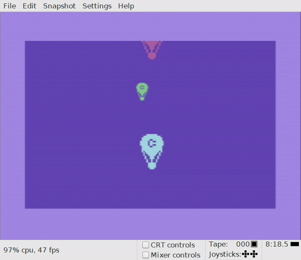
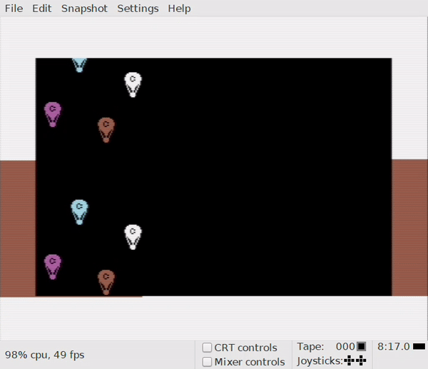

Recreating the Commodore 64 User Guide code samples in cc65. Part three: Sprites
================================================================================
We have now arrived at chapter 6 in the Commodore 64 User Guide, «Sprite Graphics». Very exiting, indeed! This chapter
describes how to create a really nice looking Commodore Balloon and make it appear to be floating on the screen. The
full version of the sample code puts three balloons on the screen simultaneously, and reads as follows:

```basic
1 rem up, up and away!
5 print chr$(147)
10 v = 53248 : rem start of display chip
11 poke v + 21, 28: rem enable sprite 2, 3, 4
12 poke 2042, 13: poke 2043, 13: poke 2044, 13
13 rem sprite 2, 3, 4 data from 13th blk
20 for n = 0 to 62: read q: poke 832 + n, q: next
25 poke v + 23, 12: poke v + 29, 12: rem expand sprites 2, 4
30 for x = 1 to 190
40 poke v + 4, x: rem update x coordinates
45 poke v + 6, x
48 poke v + 8, x
50 poke v + 5, x: rem update y coordinates
55 poke v + 7, 190 - x
58 poke v + 9, 100
60 next x
70 goto 30
200 data 0,127,0,1,255,192,3,255,224,3,231,224
210 data 7,217,240,7,223,240,7,217,240,3,231,224
220 data 3,255,224,3,255,224,2,255,160,1,127,64
230 data 1,62,64,0,156,128,0,156,128,0,73,0,0,73,0
240 data 0,62,0,0,62,0,0,62,0,0,28,0
```

As with the previous BASIC examples, you may copy the code and paste it into the VICE emulator and then type RUN to
execute it. The resulting screen will look like this:



The sprite data is placed in BASIC data statements, which is not a particularly flexible way to define and retrieve
sprite data. Our C version of this program looks like this:

```c
#include <stdio.h>
#include <stdlib.h>
#include <conio.h>
#include <peekpoke.h>

const char sprite[] = {
0,127,0,1,255,192,3,255,224,3,231,224,
7,217,240,7,223,240,7,217,240,3,231,224,
3,255,224,3,255,224,2,255,160,1,127,64,
1,62,64,0,156,128,0,156,128,0,73,0,0,73,0,
0,62,0,0,62,0,0,62,0,0,28,0
};

int v = 0xD000; // START OF DISPLAY CHIP

// Need wait function to slow down x loop
void rasterWait(void) {
unsigned char raster;
do {
raster = PEEK(v + 18);
} while (raster < 250 || raster > 252);
}

int main (void)
{
unsigned char n;
unsigned char x;
unsigned char t;
printf ("%c", 147);
POKE(v + 21, 28); // ENABLE SPRITE 2, 3, 4
POKE(2042, 13); // SPRITE 2 DATA FROM 13TH BLK
POKE(2043, 13); // SPRITE 3 DATA FROM 13TH BLK
POKE(2044, 13); // SPRITE 4 DATA FROM 13TH BLK

	for (n = 0 ; n < sizeof(sprite) ; n++) {
		POKE(832 + n, sprite[n]);
	}
	POKE(v + 23, 12); // Expand sprite 2, 4 x direction
	POKE(v + 29, 12); // Expand sprite 2, 4 y direction
	
	do {
		for (x = 1 ; x <= 190; x++) {
			POKE(v + 4, x); 		// UPDATE X COORDINATES
			POKE(v + 6, x);
			POKE(v + 8, x);
			POKE(v + 5, x); 		// UPDATE Y COORDINATES
			POKE(v + 7, 190 - x);
			POKE(v + 9, 100);
			rasterWait();
		}
	} while (1);
    return EXIT_SUCCESS;	

}
```

After building and running this example, you may notice that the sprites move faster in the C version than in the BASIC
version, but otherwise they both look exactly the same.

From the C code, you may notice that the sprite data is defined in an array. But cc65 also allows data to be defined in
external files that can be imported when compiling and building the code, much like in this example. The advantage of
this approach is that graphics data can be defined in external resource files. These files can be edited using a
graphics editor, thus cleanly separating resource data from program code.

Now, let’s make things really interesting! Did you know that you can use raster tricks in order to display more than the
hardware limit of 8 sprites? I bet you did! But is cc65 based programs fast enough to use these tricks? Well, yes. That
is, if there isn’t too much going on at the same time, and you really should read the chapter «cc65 coding hints» on how
to optimize your code for running on a 6502 platform. The following code can be run to display 16 sprites
simultaneously:

```c
// up-up-and-away-expanded.c
#include <stdio.h>
#include <stdlib.h>
#include <conio.h>
#include <peekpoke.h>

const char sprite[] = {
0,127,0,1,255,192,3,255,224,3,231,224,
7,217,240,7,223,240,7,217,240,3,231,224,
3,255,224,3,255,224,2,255,160,1,127,64,
1,62,64,0,156,128,0,156,128,0,73,0,0,73,0,
0,62,0,0,62,0,0,62,0,0,28,0
};

// Pre-calculated sinus values
const char yValues[] = {
32, 35, 38, 41, 44, 47, 49, 52,
54, 56, 58, 60, 61, 62, 63, 63,
64, 63, 63, 62, 61, 60, 58, 56,
54, 52, 49, 47, 44, 41, 38, 35,
32, 28, 25, 22, 19, 16, 14, 11,
9, 7, 5, 3, 2, 1, 0, 0,
0, 0, 0, 1, 2, 3, 5, 7,
9, 11, 14, 16, 19, 22, 25, 28
};

int v = 0xD000; // START OF DISPLAY CHIP
int rasterAdr = 0xD012; // Raster address

// Raster wait with line argument
void rasterWait(unsigned char line) {
unsigned char raster;
do {
raster = PEEK(rasterAdr);
} while (raster < line);
}

int main (void)
{
unsigned char n, t;
int rx, x, adr, t2, adrY = v + 1;
char sx, msb;
POKE(v + 33, 0); // Set background color

    printf ("%c", 147);
	for (n = 0 ; n < sizeof(sprite) ; n++) {
		POKE(832 + n, sprite[n]);
	}
	POKE(v + 21, 255); 			// ENABLE SPRITES 0-7
	for (t = 0 ; t < 8 ; t++) {
		POKE(2040 + t, 13); // Set sprite x data from 13th block for all sprites
	}

	do {
		for (x = 0 ; x < 550; x++) { 
			msb = 0; // MSB of X coordinates
			// Wait until raster hits position 250 before drawing upper sprites
			rasterWait(250);
			 // Set border color, which indicates the raster position
			POKE(v + 32, 1);
			rx = x;
			for (t = 0 ; t < 8 ; t++) {
				rx -= 24;
				t2 = t * 2;
				if (rx >= 0 && rx < 366) {
					// Usually I would calculate the sprite X coordinate using
					// the expression sx = rx % 256, but bitwise operation is
					// significant faster
					sx = rx & 255; 
					if (rx > 255) {
						// Set MSB of x coordinate for sprite if x position > 255
						msb |= 1 << t; 
					}
					POKE(v + t2, sx);
					// Y position is an indirect Sinus function of X, using array
					// index for retrieving the Y value
					POKE(adrY + t2, yValues[sx & 63] + 40);
				} else {
					POKE(v + t2, 0);
				}
			}
			POKE(v + 16, msb); // Set MSB of x coordinate
			 // Wait until raster hits position 135 before drawing lower sprites
			rasterWait(135);
			POKE(v + 32, 2); // Set border color
			for (t = 0 ; t < 8 ; t++) {
				adr = adrY + (t * 2); 
				// Add 128 to current sprite Y position
				POKE(adr, PEEK(adr) + 128);
			}
		}
	} while (1);
    return EXIT_SUCCESS;	

}
```

Running this program in VICE should produce the following output:



Notice how the border color changes at the middle of the screen. This marks where the raster wait function returns to
the main program loop. Setting border color is a common trick used by game programmers to indicate how much CPU time is
left for the main loop before breaking the 50 frames per second limit, and is very useful when optimizing code.

The balloons are moving in a sinus pattern. This is achieved using pre-calculated sinus values that are stored in an
array. Calculating sinus values on the fly would demand too much CPU resources for the program to work properly.

The last part of this exciting saga deals with [sound](sound.md). What are you waiting for? Let’s go!
